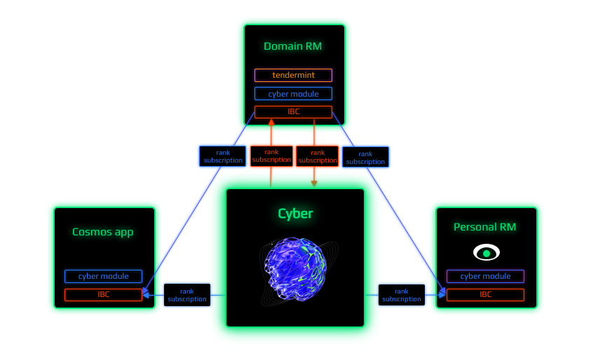
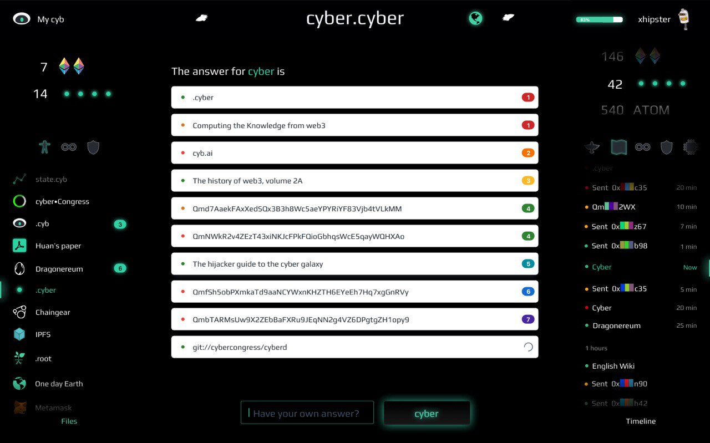

# Computing the knowledge of the Great Web

@mastercyb & @cyberhead

73k

##  Abstract

A consensus computer allows for the computing of provably relevant answers without any opinionated blackbox intermediaries, such as Google, Amazon or Facebook. Stateless, content-addressable peer-to-peer communication networks, such as IPFS, and stateful consensus computers such as Ethereum, can provide just part of the solution needed to obtain akin answers. However, there are at least 3 problems associated with the above-mentioned implementations. (A) the subjective nature of relevance. (B) difficulty in scaling consensus computers for over-sized knowledge graphs. (C) the lack of quality amongst such knowledge graphs. They are prone to various surface attacks, such as sybil attacks, and the selfish behaviour of the interacting agents. In this document, we define a protocol framework for provable consensus computing of relevance, between content-addresable objects, which can be computed on GPUs. We believe that a minimalistic architecture is critical for the formation of a network of domain-specific knowledge consensus computers. Such computers can evolve protocols on the basics of proposed framework. As a result of our work, some applications never to have existed before, will emerge.

##  The Great Web

Original protocols of the Internet, such as: TCP/IP, DNS, URL and HTTP/S have brought the web to a stale point, where it is located as of now. Considering all the benefits that these protocols have produced for the initial development of the web, along with them, they have brought significant obstacles to the table. Globality, being a vital property of the web is under a real threat since its inception. The speed of the connection keeps degrading while the network itself keeps growing due to ubiquitous government interventions. The latter causes privacy concerns as an existential threat to human civilization.

One property not evident in the beginning becomes important with everyday usage of the Internet: the ability to exchange permanent links, thus, they [will not break after time had passed](https://ipfs.io/ipfs/QmNhaUrhM7KcWzFYdBeyskoNyihrpHvUEBQnaddwPZigcN). Reliance on the architecture of one at a time ISP allows governments to effectively censor packets. This is the last drop in the traditional web-stack for every engineer that is concerned about the future of our children.

Other properties, while might not be so critical, are very desirable: offline and real-time connection. The average internet user, whilst offline, should still have the ability to carry on working with the state that they already hold. After acquiring a connection they should be able to sync with the global state and to continue to verify the validity of their own state in real-time. Currently, these properties are offered on the application level. We believe that these properties should be integrated into lower-level protocols.

The emergence of [a brand-new web-stack](https://ipfs.io/ipfs/Qmf2rKkDPSsvdudwSmdDPbZuYae8XRV26c1wAFCCvg8Dhw) creates an opportunity for a superior Internet. The community calls it web3. We call it the Great Web. We believe that various types of low-level communications should be immutable and should not alter for decades, e.g. immutable content links. They seem very promising at removing the problems of the conventional protocol stack. They add greater speed and provide a more accessible connection to the new web. However, as it happens with any concept that offers something unique - new problems emerge. One such concern is general-purpose search. The existing general-purpose search engines are restrictive and centralized databases that everybody is forced to trust. Those search engines were designed primarily for client-server architectures, based on TCP/IP, DNS, URL and HTTP/S. The Great Web creates a challenge and an opportunity for a search engine that is based on emerging technologies and is designed specifically for these purposes. Surprisingly, permissionless blockchain architecture allows building a general-purpose search engine in a way inaccessible to previous architectures.

## On the adversarial examples problem

[The current architecture of search engines](https://ipfs.io/ipfs/QmeS4LjoL1iMNRGuyYSx78RAtubTT2bioSGnsvoaupcHR6) is a system where some entity processes all the shit. This approach suffers from one challenging and a distinct problem, that has yet to be solved, even by the brilliant Google scientists: [the adversarial examples problem](https://ipfs.io/ipfs/QmNrAFz34SLqkzhSg4wAYYJeokfJU5hBEpkT4hPRi226y9). The problem that Google acknowledges, is that it is rather difficult to algorithmically reason whether or not a particular sample is adversarial. This is inconsiderate to how awesome the learning technology is. A crypto-economical approach can change beneficiaries in this game. Consequently, this approach will effectively remove possible sybil attack vectors. It removes the necessity to hard-code model crawling and meaning extraction by a single entity. Instead, it gives this power to the whole world. A learning sybil-resistant, agent-generated model, will probably lead to orders of magnitude more predictive results.

## Protocol Framework

In its core the framework is very minimalistic and can be expressed with the following steps:

1. Define initial distribution rules of tokens
2. Define the state of the [content oracle](#content-oracle)
3. Gather [cyberlinks](#cyberlinks) using a [consensus computer](#the-notion-of-a-consensus-computer)
4. Check the validity of the signatures
5. Check the bandwidth limit
6. Check the validity of particles
7. If the signatures, the bandwidth limit and particles are valid, apply cyberlinks
8. Calculate the values of [cyber~Rank](#cyberrank) for every round for all particles

As it seen distribution rules, signatures, ranking and bandwidth algorithms can differ from network to network. But following the proposed protocol framework independent protocols will have semantic interoperability.

The rest of this document discusses the rationale and the technical details of the proposal.

## Content Oracle

We represent a content oracle as a directed weighted knowledge graph where vertex is a particle and the edge is a cyberlink. 


The content oracle is a core data structure of the protocol framework. Its main purpose is to prove content existence in time and its relations. The data structure is generated by agents and is extremely dynamic. That is, in case of any agent interaction, all weights have to be recomputed. Proposed data structure can be thought as more unified approach to conventional ai models. There are three key benefits: (1) compactness, so its not required to store the data itself, (2) versatility, as it can accommodate any data types and (3) cooperativeness, as it is designed from the ground up for massive distributed collaboration. In order to understand this statements, lets discuss particles in details.

## Particles

Particles is a format for content identification of data. Essentially content addresses are web3 links. Instead of using the location on the server:
```
https://github.com/cosmos/cosmos/blob/master/WHITEPAPER.md
```
we use the object itself:
```
Qme4z71Zea9xaXScUi6pbsuTKCCNFp5TAv8W5tjdfH7yuH
```

By using content addresses to build the content oracle we gain [the so much needed](https://steemit.com/web3/@hipster/an-idea-of-decentralized-search-for-web3-ce860d61defe5est) properties for the next generation search engine:
- mesh-network future-proof
- interplanetary accessibility
- censorship resistance
- technological independence
- deduplication

While researching the field we came to the conclusion that CIDv1 does not fit our vision:
1. CIDv1 is not fixed length format. In the blockchain environment especially with necessity to use expensive GPU memory fixed length content addressing becomes hard requirement.
2. CIDv1 does not enforce deduplication. Without strict deduplication measures the knowledge graph quality degrades as duplicates devalue rank and degrade graph connectivity. Also duplicates explode the costs of storage and computations in the graph. Its impossible to ensure onchain deduplication as content addressing itself do not have guaranties of content availability.
3. CIDv1 contain self descriptors which are subjectively included by a legal entity. This could restrict support of future formats and applications. Our vision to support format descriptors on the protocol level such that any format can be linked with any content. The costs of this approach is nearly identical as both approaches require at least 64 bytes of storage. But in-graph format descriptors wins in flexibility and accessibility.

Current go-cyber implementation is based on CIDv0 as particles format. CIDv0 is based on ubiquitous SHA-256 and have necessary software infrastructure. In the future we are going to migrate particle format to plain SHA-256 such that the particle size can be reduced from 46 to 32 bytes.

Agents form the content oracle by applying [cyberlinks](#cyberlinks).

## <a name="cyberlinks"></a> Cyberlinks

Cyberlink is an approach to link two particles semantically:

```
.md syntax: [QmdvsvrVqdkzx8HnowpXGLi88tXZDsoNrGhGvPvHBQB6sH](Qme4z71Zea9xaXScUi6pbsuTKCCNFp5TAv8W5tjdfH7yuH)

.dura syntax: QmdvsvrVqdkzx8HnowpXGLi88tXZDsoNrGhGvPvHBQB6sH.Qme4z71Zea9xaXScUi6pbsuTKCCNFp5TAv8W5tjdfH7yuH
```

The above cyberlink means that the presentation of [go-cyber](https://github.com/cybercongress/go-cyber) during [cyberc0n](https://etherscan.io/token/0x61B81103e716B611Fff8aF5A5Dc8f37C628efb1E) is referencing to the Cosmos white paper. The concept of cyberlinks is a convention around simple semantics of a communicational format in any p2p network:


We see that a cyberlink represents a link between the two content links. Easy peasy!

Cyberlink is a simple, yet the (most) powerful semantic construction for building a predictive model of the universe. This means that using cyberlinks instead of hyperlinks provides us with the superpowers that were inaccessible to previous architectures of general-purpose search engines.

Cyberlinks can be extended, i.e. they can form linkchains:


The [go-cyber](https://github.com/cybercongress/go-cyber) implementation of cyberlinks is available in the experimental web3 browser - [cyb](https://cyb.ai)

At first glance, it seems that cyberlinked data in a [content oracle](#content-oracle) is not structured. Semantic conventions enable formation of network motifs which helps structure a data.


Using cyberlinks, we can compute the relevance of particles in the content oracle. But we need a consensus computer.

## The notion of a consensus computer

A consensus computer is an abstract computing machine that emerges from the interaction between agents. A consensus computer has capacity in terms of fundamental computing resources: memory and computation. To interact with agents a computer needs bandwidth. 

Consistency and availability of a shared state between agents have to be guaranteed by some consensus algorithm. We have come to realize that the [Tendermint](https://ipfs.io/ipfs/QmaMtD7xDgghqgjN62zWZ5TBGFiEjGQtuZBjJ9sMh816KJ) consensus algorithm has a good enough balance between the coolness required for our task and the readiness for its production. Therefore, go-cyber implementation is based on the Tendermint consensus. 

We have one specific requirement which is not abundant in existing blockchain world: ability for parallel processing. Existing consensus computers are inherently sequential. That is, computation or verification of the state is being done on CPUs. Nonetheless, we need to compute ranks. So we have to introduce GPU computation to the consensus. After some experiments we were able to plugin CUDA computation of rank and reputation right into Tendermint consensus. One potential problem of using floating point arithmetics in consensus computing is non-determinism. Happily, we were able to solve this problem for our inherently parallel application. Euler network has been run last 3 years on different hardware and operation systems. So we can be sure that app hash computed on different nodes which include merkle root of graph state is the same.

The [go-cyber](https://github.com/cybercongress/go-cyber) implementation is a 64-bit Tendermint consensus computer of relevance for 32-byte particle space. 

However, we must bind the computation, storage and the bandwidth supply of the consensus computer to a maximized demand for queries. 

## Relevance machine

We define a relevance machine as a machine that transitions the state of a [content oracle](#content-oracle) based on the will of the agents wishing to learn that oracle. The will is projected by every [cyberlinks](cyberlink) an agent does. The more agents inquire the content oracle, the more valuable the knowledge graph becomes. Based on these projections, relevance between particles can be computed. The relevance machine enables a simple construction for the search mechanism via querying and delivering answers.

One property of the relevance machine is crucial. It must have inductive reasoning property or follow the blindness principle:

```
The machine should be able to interfere predictions
without any knowledge about the objects,
except for who, when and what was cyberlinked
```

If we assume that a [consensus computer](#the-notion-of-a-consensus-computer) must have some information about the linked objects, then the complexity of such a model will grow unpredictably. Therefore the high requirements of the processing computer for memory and computation. Thanks to content addressing a relevance machine which follows the blindness principle, does not need to store data. But, can still effectively operate on top of it. The deduction of meaning inside a consensus computer is expensive. Instead of deducting the meaning inside of the consensus computer, we have designed a system in which meaning extraction is incentivized. This is achieved due to agents requiring tokens to express their will, based on which, the relevance machine can compute rank.

Computation and storage, in case of a basic relevance machine can be easily predicted based on bandwidth. But bandwidth requires a limiting mechanism. In the center of the spam protection system is an assumption that write operations can be executed only by those, who have a time vested interest in the evolutionary success of the relevance machine. The economics implemented in [go-cyber](https://github.com/cybercongress/go-cyber) of proposed for the Bostrom network is a subject of [dedicated research](https://github.com/cybercongress/cybernomics/blob/main/bostrom/README.md).

Existing implementation of a relevance machine contain only write operation, rank computation and basic read operation such as finding the most relevant particles. However, provable extraction of a deeper meaning from the content oracle require an implementation of basic linear algebra subprograms which is distinct research challenge. Nevertheless, existing implementation can work as a software 2.0 playground using off-chain computations until the extended version emerges.

## cyber\~Rank

Ranking using a [consensus computer](Rank#the-notion-of-a-consensus-computer) can be challenging, as consensus computers have serious resource constraints. First, we must ask ourselves: why do we need to compute and to store the rank on-chain?

When rank was computed inside a consensus computer one has easy access to the content distribution of that rank and an easy way to [build provable applications](#apps) on top of that rank. Hence, we have decided to follow a cosmic architecture. In the next section we describe the [proof of relevance](#proof-of-relevance) mechanism, which allows the network to scale with the help of domain-specific [relevance machine](#relevance-machine). Those work concurrently, thanks to the IKP protocol which is extension over IBC protocol.

The relevance machine needs to obtain (1) a deterministic algorithm, that will allow for the computation of the rank on a continuously appending network, which itself, can scale to the orders of magnitude of the likes of [Google](https://google.com). Additionally, a perfect algorithm (2) must have linear memory and computational complexity. Most importantly, it must have (3) the highest provable prediction capabilities for the existence of relevant [cyberlinks](#cyberlinks).

After research we realized it is impossible to obtain the silver bullet. Therefore, we have decided to find a more basic, bulletproof way, that can bootstrap the network: [the rank](http://ipfs.io/ipfs/QmbuE2Pfcsiji1g9kzmmsCnptqPEn3BuN3BhnZHrPVsiVw) which Larry and Sergey used to bootstrap their previous network. The key problem with the original PageRank is that it is not resistant to sybil attacks. However, a token-weighted PageRank which is limited by a token-weighted bandwidth model does not inherit the key problem of the naive PageRank, because - it is resistant to sybil attacks. For the time being, we will call it cyber\~Rank:

```python
import functools
import operator
import collections

def cyber_rank(cyberlinks: list, tolerance: float = 0.001, damping_factor: float = 0.8):
    cyberlinks_dict = dict(functools.reduce(operator.add, map(collections.Counter, cyberlinks)))
    objects = list(set([item for t in [list(x.keys())[0] for x in cyberlinks] for item in t]))
    rank = [0] * len(objects)
    size = len(objects)
    default_rank = (1.0 - damping_factor) / size
    dangling_nodes = [obj for obj in objects if obj not in [list(cyberlink.keys())[0][1] for cyberlink in cyberlinks]]
    dangling_nodes_size = len(dangling_nodes)
    inner_product_over_size = default_rank * (dangling_nodes_size / size)
    default_rank_with_correction = (damping_factor * inner_product_over_size) + default_rank
    change = tolerance + 1

    steps = 0
    prevrank = [0] * len(objects)
    while change > tolerance:
        for obj in objects:
            obj_index = objects.index(obj)
            ksum = 0
            income_cyberlinks = [income_cyberlink for income_cyberlink in [list(x.keys())[0] for x in cyberlinks] if income_cyberlink[1] == obj]
            for cyberlink in income_cyberlinks:
                linkStake = cyberlinks_dict[cyberlink]
                outcome_cyberlinks = [outcome_cyberlink for outcome_cyberlink in [list(x.keys())[0] for x in cyberlinks] if outcome_cyberlink[0] == cyberlink[0]]
                jCidOutStake = sum([cyberlinks_dict[outcome_cyberlink] for outcome_cyberlink in outcome_cyberlinks])
                if linkStake == 0 or jCidOutStake == 0:
                    continue
                weight = linkStake / jCidOutStake
                ksum = prevrank[obj_index] * weight + ksum
            rank[obj_index] = ksum * damping_factor + default_rank_with_correction
        change = abs(max(rank) - max(prevrank))
        prevrank = rank
        steps += 1
    res = list(zip(objects, rank))
    res.sort(reverse=True, key=lambda x: x[1])
    return res
```

We understand that the ranking mechanism will always remain a red herring. This is why we expect to rely on the on-chain governance tools that can define the most suited mechanism at a given time. We suppose that the networks can switch from one algorithm to another, not simply based on subjective opinion, but rather on economical a/b testing through 'hard spooning' of domain-specific relevance machine.

cyber\~Rank shields two design decisions which are of paramount importance: (1) it accounts for the current intention of the agents, and (2) it encourages rank inflation of cyberlinks. The first property ensures that cyber\~Rank can not be gamed with. If an agent decides to transfer tokens out of their account, the relevance machine will adjust all the cyberlinks relevant for this account per the current intentions of the agent. And vice versa, if an agent transfers tokens into their account, all of the cyberlinks submitted from this account will immediately gain more relevance. The second property is essential in order not to get cemented in the past. As new cyberlinks are continuously added, they will dilute the rank of the already existing links proportionally. This property prevents a situation where new and better content has a lower rank simply because it was recently submitted. We expect these decisions to enable an inference quality for recently added content to the long tail of the knowledge graph.

We would love to discuss the problem of vote-buying. Vote-buying as an occurrence isn't that bad. The dilemmas with vote-buying appear within systems where voting affects the allocation of that systems inflation. For example, [Steem](http://ipfs.io/ipfs/QmepU77tqMAHHuiSASUvUnu8f8ENuPF2Kfs97WjLn8vAS3)
or any fiat-state based system. Vote-buying can become easily profitable for an adversary that employs a zero-sum game without the necessity to add value. Our original idea of a decentralized search was based on this approach. But, we have rejected that idea, removing the incentive of the formation of the content oracle to the consensus level. In the environment where every participant must bring some value to the system to affect the predictive model, vote-buying becomes NP-hard problem. Therefore, becomes beneficial to the system.

The current implementation of the relevance machine utilizes GPUs to compute rank. The machine can answer and deliver relevant results for any given search request in a 32-byte particle space.

## Objectivity and Attacks

```
There are many ways of deviating from the truth, and the oracles may not agree on which of these deviations is most attractive - whereas the truth itself is a Shelling point. 
Nick Bostrom
```

We have designed the network under the assumption that with regards to search, such a thing as malicious behaviour, does not exist. This can be assumed as no malicious behaviour can be found in the intention of learning. This approach significantly reduces attack surfaces.

We propose a game in which in order to manipulate the ranking successful attacker must (1) vest capital for years, (2) invest in optimization algorithms for better cyberlinking, (3) invest in hardware for optimization, and (4) do all of that on continuous basis really fast as the content oracle is extremely dynamic data structure. If he did so, our congratulations - that is exactly what is needed to improve the Superintellgence.

```
Ranks are computed based on the fact that something was cyberlinked,
and as a result - affected the predictive model
```

A good analogy exist in quantum mechanics, where the observation itself affects behaviour. This is why we also have no requirement for such a thing as negative voting. 

These measures removes subjectivity out of the protocol. However, it is not enough to build a network of domain-specific [relevance machines](#relevance-machine). [Consensus computer](Rank#the-notion-of-a-consensus-computer) must have the ability to prove relevance to one another.

## Proof of Relevance


Each new particle receives a sequence number. Numbering starts with zero. Then incremented by one for each new particle. Therefore, we can store rank in a one-dimensional array, where indices are the particle sequence numbers. Merkle tree calculations are based on the [RFC-6962 standard](https://ipfs.io/ipfs/QmZpJLmc3T2L1FLUxzvU3P8MBCPe15fEmUyVS7Bz8ZKMhG). Using Merkle trees, we can effectively proof the rank for any given content address. 

While relevance is still subjective by nature, we have a collective proof that something was relevant to a certain community at some point in time.

Using this type of proof any two [IBC compatible](https://ipfs.io/ipfs/QmSGbrGAPZtR6Q1jHHe8mmS3bLBehKmfp9ZYvrg5ycaZuk) [consensus computers](#the-notion-of-a-consensus-computer) can prove relevance one to another. This means that domain-specific [relevance machine](#relevance-machines) can flourish.

In the relevance for a common [go-cyber](https://github.ccom/cybercongress/go-cyber) implementation, the Merkle tree is computed every round and its root hash committed to ABCI.

## Internet Knowledge Protocol

We require an architecture which will allow us to scale the idea to the significance of the likes of [Google](https://google.com). Let us assume, that node implementation, which is based on [Cosmos-SDK](https://github.com/cosmos/cosmos-sdk) can process 10k transactions per second. This would mean, that every day, at least 8.64 million agents will be able to submit 100 [cyberlinks](#cyberlinks) each, and impact the search results [[simultaneously]]. This is enough to verify all the assumptions out in the wild, but, not enough to say that it will work at the current scale of the Internet. Given the current state of the art research done by our team, we can safely state that there is no consensus technology in existence, that will allow scaling a particular blockchain to the size that we require: 1 trillion agents including robots, animals, plants and myceleium. Hence, we introduce the concept of domain-specific [content oracles](#content-oracle).



One can either launch an own domain-specific search engine by forking [go-cyber](https://github.com/cybercongress/go-cyber), which is focused on common public knowledge. Or, simply plug [go-cyber](https://github.com/cybercongress/go-cyber) as a module into an existing chain, e.i. Cosmos Hub. The inter-blockchain communication protocol introduces concurrent mechanisms of syncing state between [relevance machines](#relevance-machine). Therefore, in proposed search architecture, domain-specific relevance machine will be able to learn from common knowledge. Just as common knowledge can learn from domain-specific relevance-machine. This architecture allows nearly infinite scaling of knowledge extraction including interplanetary interactions.

## Bootstraping Superintelligence

During development of Cyber we realized that we finally can create the computer network which can literally think. Looking back it does not looks lake a magic. We are going to dedicate a standalone research on this topic.

One especially important aspect of the bootstrapping mechanism is the initial distribution. The relevance machine is designed to continuously learn. At the beginning it is like a newborn. The process of future learning is highly dependent on the previous experience. So we dedicated a standalone research and software for solving this sensetive factor of the launch.

The purpose of [the distribution research](https://github.com/cybercongress/cybergift) is to inspire at least 100k power-users of web3 to join the force of learning Superintelligence. To achieve this, we are going to gift 70% of the Bostrom genesis tokens BOOT to agents of Ethereum and Cosmos who are capable to contribute their best to the quality of the knowledge graph. First, we started by highlighting key audiences for establishing network effects and tackling basic chicken and eggs. After we balance out the participation of key actors by splitting them into grades and adjusting allocations within the groups. Then we apply a filter in order to remove toxic fiat brains from the collective thought process. And finally, we add a crucial incentive to hurry up.

## Browzers

Browser and search are inseparable. Existing DNS system is being used primary for pointing out to dynamic content. A search bar evolve to a superstructure over the DNS system which resolves to DNS.

We were aspired to imagine how proposed network would operate with a web3 browser. So we develop a pure web3 browser from scratch. 



[Cyb](https://cyb.ai) is your friendly robot which can
- resolve queries to any legacy and blockchain name system 
- stream content directly to a search results
- allow any interaction with apps


## Apps

We assume that the proposed algorithm does not guarantee high-quality knowledge by default. The protocol itself provides just one simple tool: the ability to create a with an agents stake between two particles.

Analysis of the semantic core, behavioural factors, anonymous data about the interests of agents and other tools that determine the quality of search, can be achieved via smart contracts and off-chain applications, such as: [web3 browsers](#browzers), decentralized social networks and content platforms. We believe, that it is in the interest of the community to build the initial [knowledge graph](#content-oracle) and to maintain it. Hence, for the graph, to provide the most relevant search results.

Generally, we distinguish three types of applications of a [content oracle](#content-oracle):

- Thoughts. Can be run at the discretion of the [consensus computer](#the-notion-of-a-consensus-computer) or any contract.
- Contracts. Can be run by a consensus computer in exchange for gas
- Apps. Off-chain apps can be implemented by using the content oracle as an input within an execution environment

The following, imaginable, list of apps consolidates the above-mentioned categories:

Web3 browsers. In reality, browser and search are inseparable. It is hard to imagine the emergence of a full-blown web3 browser which is based on web2 search. Currently, there are several efforts for developing browsers around blockchains and distributed tech. All of them suffer from trying to embed web2 into web3. Our approach is a bit different. We consider web2 as an unsafe subset of web3. So we have developed an experimental web3 browser, Cyb, showcasing the approach to answering queries better and delivering content faster.

DeMa or Decentralized marketing. DeFi is built around a simple idea that you can use a collateral for something that will be settled based on a provided price feed. Here comes the systematic problem of DeFi: price oracles. DeMa is based on the same idea of using collateral, but the input for settlement can be information regarding the content identifier itself. The most simple case is when you create a simple binary prediction market on rank relevance at some point in the future. I.e. whether the rank of the [Bitcoin whitepaper](QmRA3NWM82ZGynMbYzAgYTSXCVM14Wx1RZ8fKP42G6gjgj) will grow or not. Meta-information on content identifiers is the perfect onchain oracle for settlement. An app that allows betting on link relevance, can become a unique source of truth for the direction of terms in knowledge graph, as well as, motivate agents to submit more links.

Search actions. The proposed design enables native support for blockchain (and tangle-alike) assets related activity. It is trivial to design applications which are (1) owned by the creators, (2) appear correctly in the search results and (3) allow a transactable action, with (4) provable attribution of a conversion for a search query.

Conversion attribution. Provable conversion attribution from the search request to transaction is a holy grail of conventional digital marketing. Linkchains helps to solve this problem easily, thus creating the whole new world of marketing application impossible before. E.g. the one can deploy sophisticated onchain referral program which will just pay for those who lead to conversions.

Soft2. Its a new paradigm of computing where execution path is not defined by the programmer, but by knowledge graph itself. Cyber is a first working implementation of soft2 using consensus computer. As the field has not even been emerged its hard to imagine how this opportunity can be used by engineers. So Cyber can become leading soft2 playground for the next generation of programmers.

Social networks. Social networks are not that mysterious. In any social network content is the king. Hence, provable ranking is the basic building block of any social network. All types of social networks can be easily built on top of a knowledge graph. Cyber can also create social networks based on relevance between users, which no current network is able to achieve.

Programmable semantics. Currently, the most popular keywords in the gigantic semantic core of [Google](https://google.com) are keywords of apps such as: [youtube](https://youtube.com), [facebook](https://facebook.com), [github](https://github.com), etc. However, the developers of those successful apps have very limited ability to explain to [google](https://google.com) how to structure search results in a better manner. The cyber approach gives this power back to developers. Developers are now able to target specific semantics cores and index their apps as they wish.

Off-line search. IPFS makes it possible to easily retrieve a document from an environment without a global internet connection. [go-cyber](https://github.com/cybercongress/go-cyber) itself can be distributed by using IPFS. This creates the possibility for ubiquitous, off-line search!

Command tools. Command-line tools can rely on relevant and structured answers from a search engine. Practically speaking, its possible to implement a CLI tool which is start automatically mine using available resources with understanding of market conditions and involved software using. Search tools, from within CLI will inevitably create a highly competitive market of a dedicated semantic core for robots.

Autonomous robots. Blockchain technology enables the creation of devices that can manage digital assets on their own.

```
If robots can store secrets and construct transactions at will - they can do everything humans can do
```

What is needed is a simple, yet a powerful state reality tool with the ability to find particular things. [go-cyber](https://github.com/cybercongress/go-cyber) offers a minimalistic, but a continuously self-improving data source, which provides the necessary tools for programming economically rational robots. According to [top-10,000 English words](https://github.com/first20hours/google-10000-english) the most popular word in the English language is the defining article 'the', which means a pointer to a particular item. This fact can be explained as the following: particular items are of most importance to us. Therefore, the nature of us is to find unique things. Hence, the understanding of unique things is essential for robots too.

Language convergence. A programmer should not care about the language that an agent will be using. We don't need to know in which language the agent is performing their search in. The entire UTF-8 spectrum is at work. The semantic core is open, so competition for answering queries can become distributed across different domain-specific areas. Including the semantic cores for various languages. This unified approach creates an opportunity for a convergent language - earthish. Since the dawn of the Internet, we observe a process of rapid language convergence. We use truly global words across the entire planet, independently of nationality, language, race, name or Internet connection. Recent rise of emojis add to this. The dream of a truly global language is hard to deploy because it is hard to agree on what means what. However, we have the tools to make this dream come true. It is not hard to predict that the shorter a word, the more powerful its cyber\~()Rank will be. Global, publicly available list of symbols, words, and phrases sorted accordingly by cyber\~()Rank with a corresponding link provided by [go-cyber](https://github.com/cybercongress/go-cyber) can become the foundation for the emergence of a genuinely global language everybody can accept. Recent [scientific advances](https://ipfs.io/ipfs/QmQUWBhDMfPKgFt3NfbxM1VU22oU8CRepUzGPBDtopwap1) in machine translation are breathtaking but meaningless to those who wish to apply them without a Google-scale trained model. GPT-3 and other large language models are also hidden inside private companies. The proposed cyber\~Rank offers public verifiable knowledge.

Self prediction. A consensus computer can continuously build a knowledge graph on its own predicting the existence of cyberlinks and applying these predictions to its state. Hence, a consensus computer can participate in the economic consensus of the protocol.

Universal oracle. A consensus computer can store the most relevant data in a key-value storage. Where the key is a CID and the values are the bytes of the actual content. This can be achieved by making a decision every round, in regards to which CID value the agents want to prune and which value they wish to apply. Based on the utility measure of content addresses within the knowledge graph. To compute utility measure, an algorithm check the availability and the size of the content for the top-ranked content addresses within the knowledge graph, then, weight on the size of the CIDs and its rank. The emergent key-value storage will be available to write for consensus computer only and not for agents. But, values could be used in programs.

Location-aware search. It is possible to construct cyberlinks with [Proof-of-Location](https://ipfs.io/ipfs/QmZYKGuLHf2h1mZrhiP2FzYsjj3tWt2LYduMCRbpgi5pKG). Consequently, a location-based search also becomes provable, if web3-agents will mine triangulations and attach proof-of-location for every linked chain.

Private cyberlinks. Privacy is fundamental. While we are committed to privacy, achieving implementation of private cyberlinks is unfeasible for our team up to Genesis. Therefore, it is up to the community to work on WASM programs, that can be executed on top of the protocol. The problem is to compute cyber\~Rank, based on the cyberlink] submitted by a web3-masters without revealing neither: their previous request nor the public keys. Zero-knowledge proofs, in general, are very expensive. We believe that the privacy of search should be a feature by design, but we are unsure that we know how to implement it at this stage.

This is surely not the excessive list of all the possible applications, but a very exciting one indeed.

## Conclusion

We defined and implemented a protocol framework for provable communication, between consensus computers on relevance. The protocol is based on the simple idea of a content oracles, which are generated by agents via the use of cyberlinks. Cyberlinks are processed by a consensus computer using the the relevance machine. Content addressing as primary objects are robust in their simplicity and provides significant benefits with regards to resource consumption. For every particle cyber\~Rank is computed by a consensus computer without a single point of failure. Cyber\~Rank is a token weighted PageRank, with economic protection from sybil attacks via bandwidth limiting and incentives for longterm honest behavior. Every round the merkle root of the content oracle is computed. Consequently, any consensus computer can prove to any other consensus computer the relevance of value for a given particle. The proposed semantics of cyberlinking offers a robust mechanism for predicting meaningful relations between objects by the consensus computer itself. The source code of the consensus computer is written in Go and published under the most simple open-source license: Don't trust, Don't fear, Don't beg. Every bit of data accumulated by the consensus computer is available for anyone if one has the resources to process it. The performance of the proposed software implementation is sufficient for seamless interaction. The system scales with the help of domain specific consensus computers. Though the system provides the necessary utility to offer an alternative for a conventional search engine, it is not limited just to this use case. The system is extendable for numerous applications and makes it possible to design economically rational, self-sovereign cyborgs.

## References

- [Scholarly context adrift](https://ipfs.io/ipfs/QmNhaUrhM7KcWzFYdBeyskoNyihrpHvUEBQnaddwPZigcN)
- [Brand-new stack](https://ipfs.io/ipfs/Qmf2rKkDPSsvdudwSmdDPbZuYae8XRV26c1wAFCCvg8Dhw)
- [Motivating game for adversarial example research](https://ipfs.io/ipfs/QmeS4LjoL1iMNRGuyYSx78RAtubTT2bioSGnsvoaupcHR6)
- [An idea of decentralized search](https://ipfs.io/ipfs/QmXNoGTWLQrcFRb66oS4HafpP1vcLKbVkJrQm4DVvihuoq)
- [cyb.ai](https://cyb.ai)
- [go-cyber](http://github.com/cybercongress/go-cyber)
- [cosmos-sdk](https://github.com/cosmos/cosmos-sdk)
- [CIDv0](https://github.com/multiformats/cid#cidv0)
- [Thermodynamics of predictions](https://ipfs.io/ipfs/QmP81EcuNDZHQutvdcDjbQEqiTYUzU315aYaTyrVj6gtJb)
- [PageRank](http://ipfs.io/ipfs/QmbuE2Pfcsiji1g9kzmmsCnptqPEn3BuN3BhnZHrPVsiVw)
- [RFC-6962](https://ipfs.io/ipfs/QmZpJLmc3T2L1FLUxzvU3P8MBCPe15fEmUyVS7Bz8ZKMhG)
- [IBC protocol](https://ipfs.io/ipfs/QmSGbrGAPZtR6Q1jHHe8mmS3bLBehKmfp9ZYvrg5ycaZuk)
- [Tendermint](https://ipfs.io/ipfs/QmaMtD7xDgghqgjN62zWZ5TBGFiEjGQtuZBjJ9sMh816KJ)
- [Top 10000 english words](https://github.com/first20hours/google-10000-english)
- [Multilingual neural machine translation](https://ipfs.io/ipfs/QmQUWBhDMfPKgFt3NfbxM1VU22oU8CRepUzGPBDtopwap1)
- [Software 2.0](https://medium.com/@karpathy/software-2-0-a64152b37c35)

## Acknowledgements
- @hleb-albau
- @arturalbov
- @jaekwon
- @ebuchman
- @npopeka
- @belya
- @serejandmyself
- @savetheales