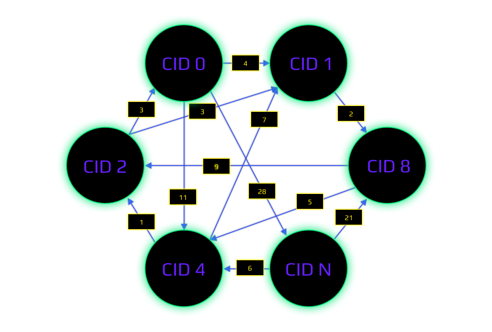
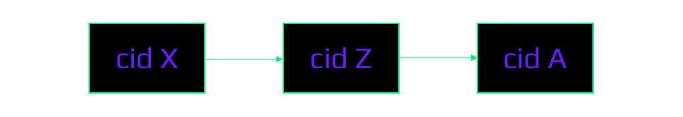
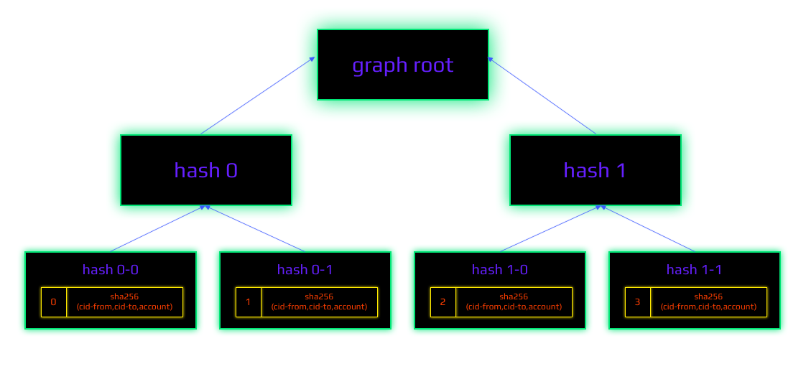
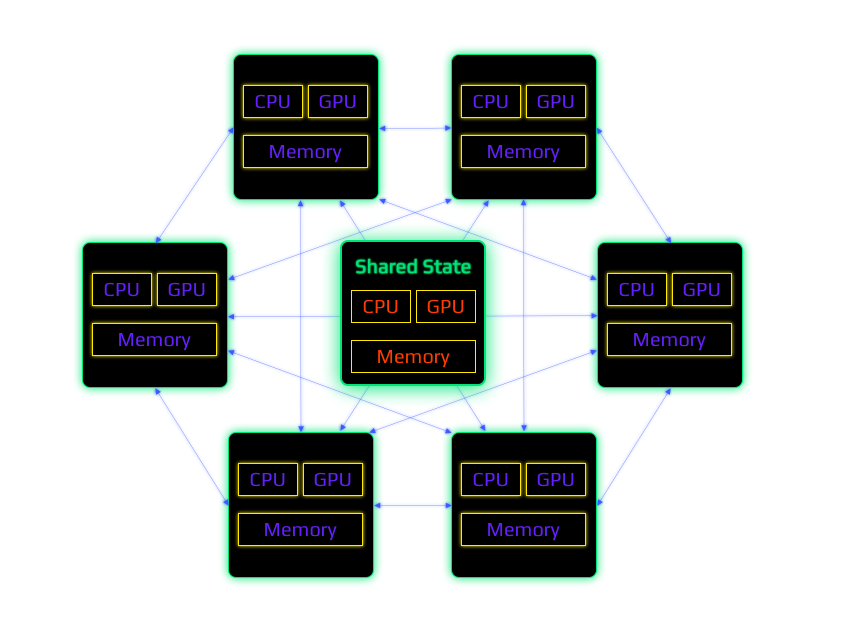
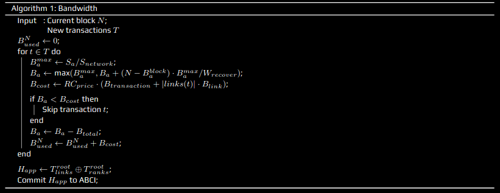
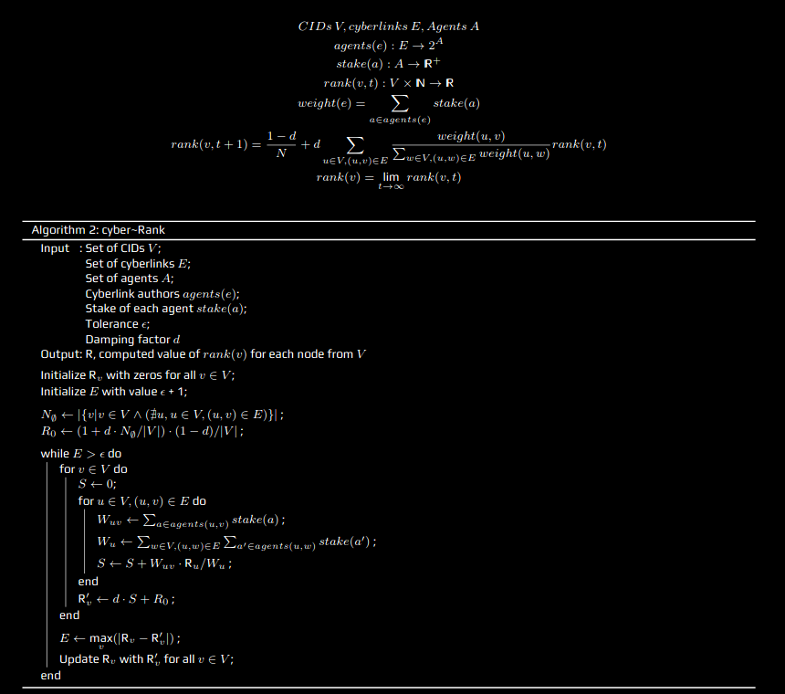
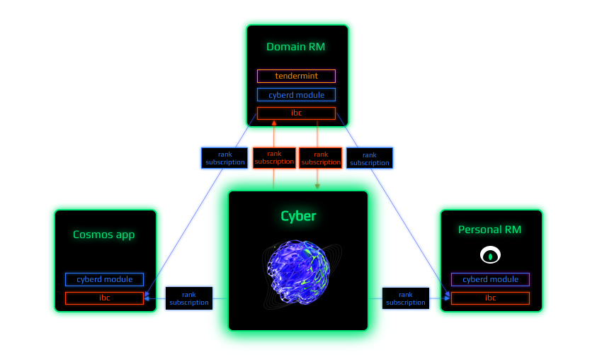
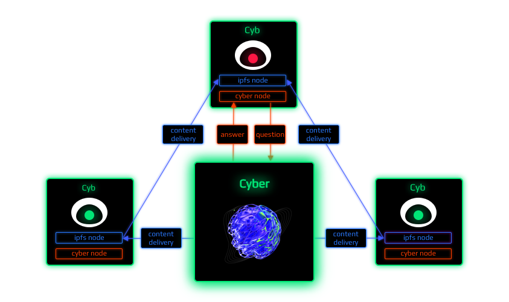
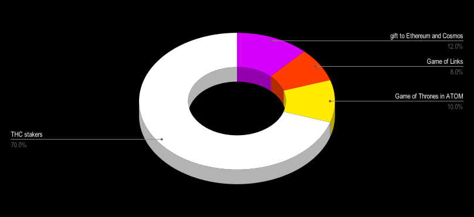

# cyber: Computing the knowledge of the Great Web

<p align="center">
  
</p>

## Abstract

A consensus computer allows for the computing of provably relevant answers without any opinionated blackbox intermediaries, such as Google, Amazon or Facebook. Stateless, content-addressable peer-to-peer communication networks, such as IPFS, and stateful consensus computers such as Ethereum, can provide just part of the solution needed to obtain akin answers. However, there are at least 3 problems associated with the above-mentioned implementations. (A) the subjective nature of relevance. (B) difficulty in scaling consensus computers for over-sized knowledge graphs. (C) the lack of quality amongst such knowledge graphs. They are prone to various surface attacks, such as sybil attacks, and the selfish behaviour of the interacting agents. In this document, we define a protocol for provable consensus computing of relevance, between IPFS objects, which is based on the Tendermint consensus of cyber\~Rank, which is computed using GPUs in consensus. As proof-of-stake consensus does not help with the initial distribution, we outline the design for ecologic and efficient distribution games. We believe that a minimalistic architecture of the protocol is critical for the formation of a network of domain-specific knowledge consensus computers. As a result of our work, some applications never to have existed before, will emerge. We expand this document with our vision of possible features and potential applications.

## The Great Web

Original protocols of the Internet, such as: TCP/IP, DNS, URL and HTTP/S have brought the web to a stale point, where it is located as of now. Considering all the benefits that these protocols have produced for the initial development of the web, along with them, they have brought significant obstacles to the table. Globality, being a vital property of the web is under a real threat since its inception. The speed of the connection keeps degrading while the network itself keeps growing due to ubiquitous government interventions. The latter causes privacy concerns as an existential threat to human rights.

One property not evident in the beginning becomes important with everyday usage of the Internet: the ability to exchange permanent links, thus, they [will not break after time had passed](https://ipfs.io/ipfs/QmNhaUrhM7KcWzFYdBeyskoNyihrpHvUEBQnaddwPZigcN). Reliance on the architecture of one at a time ISP allows governments to effectively censor packets. This is the last drop in the traditional web-stack for every engineer that is concerned about the future of our children.

Other properties, while might not be so critical, are very desirable: offline and real-time connection. The average internet user, whilst offline, should still have the ability to carry on working with the state that they already hold. After acquiring a connection they should be able to sync with the global state and to continue to verify the validity of their own state in real-time. Currently, these properties are offered on the application level. We believe that these properties should be integrated into lower-level protocols.

The emergence of [a brand-new web-stack](https://ipfs.io/ipfs/Qmf2rKkDPSsvdudwSmdDPbZuYae8XRV26c1wAFCCvg8Dhw) creates an opportunity for a superior Internet. The community calls it web3. We call it the Great Web. We believe that various types of low-level communications should be immutable and should not alter for decades, e.g. immutable content links. They seem very promising at removing the problems of the conventional protocol stack. They add greater speed and provide a more accessible connection to the new web. However, as it happens with any concept that offers something unique - new problems emerge. One such concern is general-purpose search. The existing general-purpose search engines are restrictive and centralized databases that everybody is forced to trust. Those search engines were designed primarily for client-server architectures, based on TCP/IP, DNS, URL and HTTP/S. The Great Web creates a challenge and an opportunity for a search engine that is based on emerging technologies and is designed specifically for these purposes. Surprisingly, permissionless blockchain architecture allows building a general-purpose search engine in a way inaccessible to previous architectures.

## On the adversarial examples problem

[The current architecture of search engines](https://ipfs.io/ipfs/QmeS4LjoL1iMNRGuyYSx78RAtubTT2bioSGnsvoaupcHR6) is a system where some entity processes all the shit. This approach suffers from one challenging and a distinct problem, that has yet to be solved, even by the brilliant Google scientists: [the adversarial examples problem](https://ipfs.io/ipfs/QmNrAFz34SLqkzhSg4wAYYJeokfJU5hBEpkT4hPRi226y9). The problem that Google acknowledges, is that it is rather difficult to algorithmically reason whether or not a particular sample is adversarial. This is inconsiderate to how awesome the educating technology in itself is. A crypto-economical approach can change beneficiaries in the game. Consequently, this approach will effectively remove possible sybil attack vectors. It removes the necessity to hard-code model crawling and meaning extraction by a single entity. Instead, it gives this power to the whole world. A learning sybil-resistant, agent-generated model, will probably lead to orders of magnitude more predictive results.

## Cyber protocol

In its core the protocol is very minimalistic and can be expressed with the following steps:

1. Compute the genesis of cyber protocol based on the defined distribution
2. Define the state of the [knowledge graph](#knowledge-graph)
3. Gather transactions using a [consensus computer](#the-notion-of-a-consensus-computer)
4. Check the validity of the signatures
5. Check the [bandwidth limit](#relevance-machine)
6. Check the validity of CIDs
7. If the signatures, the bandwidth limit and CIDs are all valid, apply [cyberlinks](#cyberlinks) and transactions
8. Calculate the vaules of [cyber\~Rank](#cyberrank) for every round for the CIDs on the [knowledge graph](#knowledge-graph)

The rest of this document discusses the rationale and the technical details of the proposed protocol.

## Knowledge graph

We represent a knowledge graph as a weighted graph of directed links between content addresses. Aka, content identificators, CIDs, IPFS hashes, or simply - IPFS links. In this document, we will use the above terms as synonyms.

<p align="center">
  
</p>

Content addresses are essentially web3 links. Instead of using the unclear and mutable:   

`https://github.com/cosmos/cosmos/blob/master/WHITEPAPER.md`

We use the object itself:

`Qme4z71Zea9xaXScUi6pbsuTKCCNFp5TAv8W5tjdfH7yuH`

By using content addresses to build the knowledge graph we gain [the so much needed](https://steemit.com/web3/@hipster/an-idea-of-decentralized-search-for-web3-ce860d61defe5est) [IPFS](https://ipfs.io/ipfs/QmV9tSDx9UiPeWExXEeH6aoDvmihvx6jD5eLb4jbTaKGps) - [like](https://ipfs.io/ipfs/QmXHGmfo4sjdHVW2MAxczAfs44RCpSeva2an4QvkzqYgfR) superpowers of p2p protocols that are desired for a search engine:

- mesh-network future-proof
- interplanetary accessibility
- censorship resistance
- technological independence

Our knowledge graph is generated by the awesome masters. Masters add themselves to the knowledge graph with the help of a single transaction, a cyberlink. Thereby, they prove the existence of their private keys for content addresses of their revealed public keys. By using these mechanics, a [consensus computer](#the-notion-of-a-consensus-computer) could achieve provable differentiation between subjects and objects on a knowledge graph.

Our implementation of [go-cyber](https://github.com/cybercongress/go-cyber) is based on [cosmos-SDK](https://github.com/cosmos/cosmos-sdk) identities and [CIDv0/CIDv1](https://github.com/multiformats/cid#cidv0) content addresses.

Masters form the knowledge graph by applying [cyberlinks](#cyberlinks).

## Cyberlinks

To understand how cyberlinks function we need to understand the difference between a URL link (aka, a hyperlink) and between an IPFS link. A URL link points to the location of the content, whether an IPFS link points to the content itself. The difference between web architectures based on location links and content links is radical and requires a unique approach.

Cyberlink is an approach to link two content addresses, or IPFS links, semantically:

````bash
.md syntax: [QmdvsvrVqdkzx8HnowpXGLi88tXZDsoNrGhGvPvHBQB6sH](Qme4z71Zea9xaXScUi6pbsuTKCCNFp5TAv8W5tjdfH7yuH)    
.dura syntax: QmdvsvrVqdkzx8HnowpXGLi88tXZDsoNrGhGvPvHBQB6sH.Qme4z71Zea9xaXScUi6pbsuTKCCNFp5TAv8W5tjdfH7yuH
````

The above cyberlink means that the presentation of [go-cyber](https://github.com/cybercongress/go-cyber) during [cyberc0n](https://etherscan.io/token/0x61B81103e716B611Fff8aF5A5Dc8f37C628efb1E) is referencing to the Cosmos white paper. The concept of cyberlinks is a convention around simple semantics of a communicational format in any p2p network:

<p align="center">
  
</p>

We see that a cyberlink represents a link between the two links. Easy peasy!

Cyberlink is a simple, yet a powerful semantic construction for building a predictive model of the universe. This means that using cyberlinks instead of hyperlinks provides us with the superpowers that were inaccessible to previous architectures of general-purpose search engines.

Cyberlinks can be extended, i.e. they can form linkchains if there two or more cyberlinks subsist from one master, where the second link in the first cyberlink is equal to the first link in the second cyberlink:

<p align="center">
  
</p>

If agents expand native IPFS links with something semantically richer, for example, with [dura](https://github.com/cybercongress/cyb/blob/dev/docs/dura.md) links, then consensus on the execution rules by a specific program can be reached in a more natural approach.

The [go-cyber](https://github.com/cybercongress/go-cyber) implementation of cyberlinks is available in the [.cyber](https://github.com/cybercongress/dot-cyber) app of our experimental web3 browser [cyb](https://cyb.ai), or at [cyber.page](http://cyber.page).

The cyberlinks submitted by masters are stored in a merkle tree according to the [RFC-6962 standard](https://ipfs.io/ipfs/QmZpJLmc3T2L1FLUxzvU3P8MBCPe15fEmUyVS7Bz8ZKMhG). This enables authentification for [proof-of-relevance](#proof-of-relevance).

<p align="center">
  
</p>

Using cyberlinks, we can compute the relevance of subjects and objects on the [knowledge graph](#knowledge-graph). But we need a [consensus computer](#the-notion-of-a-consensus-computer).

## The notion of a consensus computer

A consensus computer is an abstract computing machine that emerges from the interaction between agents. A consensus computer has capacity in terms of fundamental computing resources: memory and computation. To interact with agents a computer needs bandwidth. An ideal consensus computer is a computer where:

`the sum of all the computations and memory available to individuals`     
`is equal to`    
`the sum of all the verified computations and memory of the consensus computer`    


We know that:

`verifications of computations < (computations + verifications of computations)`    

Hence, we will never be able to achieve an ideal consensus computer. The CAP theorem and the scalability trilemma append more proof to this statement.

<p align="center">
  
</p>

Yet this theory can work as a performance indicator for a consensus computer. After 6 years of investing into consensus computers, we have come to realize that the [Tendermint](https://ipfs.io/ipfs/QmaMtD7xDgghqgjN62zWZ5TBGFiEjGQtuZBjJ9sMh816KJ) consensus has a good enough balance between the coolness required for our task and the readiness for its production. Therefore, we have decided to implement the [cyber](#cyber-protocol) protocol using the Tendermint consensus, which has very close settings to the Cosmos Hub. The [go-cyber](https://github.com/cybercongress/go-cyber) implementation is a 64-bit Tendermint consensus computer of relevance for 64-byte string-space. This is by far not ideal, at least as 1/146, because we have 146 validators who verify the same computations producing the [knowledge-graph](#knowledge-graph).

We must bind the computation, storage and the bandwidth supply of the consensus computer to a maximized demand for queries. Computation and storage, in case of a basic [relevance machine](#relevance-machine) can be easily predicted based on bandwidth. But bandwidth requires a limiting mechanism.

## Relevance machine

We define a relevance machine as a machine that transitions the state of a [knowledge-graph](#knowledge-graph) based on the will of the agents wishing to teach and to study that [knowledge-graph](#knowledge-graph). The will is projected by every [cyberlinks](#cyberlinks) a master does. The more agents inquire the [knowledge-graph](#knowledge-graph), the more valuable the knowledge becomes. Based on these projections, relevance between content addresses can be computed. The relevance machine enables a simple construction for the search mechanism via querying and delivering answers.

One property of the relevance machine is crucial. It must have inductive reasoning properties or follow the blackbox principle:

`The machine should be able to interfere with predictions without any knowledge about the objects,`   
`except for who, when and what was cyberlinked`   

If we assume that a [consensus computer](#the-notion-of-a-consensus-computer) must have some information about the linked objects, then the complexity of such a model will grow unpredictably. Therefore the high requirements of the processing computer for memory and computation. Thanks to content addressing a relevance machine which follows the blackbox principle, does not need to store data. But, can still effectively operate on top of it. The deduction of meaning inside a [consensus computer](#the-notion-of-a-consensus-computer) is expensive. Hence, such a design can depend on assumption blindness. Instead of deducting the meaning inside of the [consensus computer](#the-notion-of-a-consensus-computer), we have designed a system in which meaning extraction is incentivized. This is achieved due to masters requiring [CYB](#cyb) tokens to express their will, based on which, the relevance machine can compute rank.

In the center of the spam protection system is an assumption that write operations can be executed only by those, who have a vested interest in the evolutionary success of the relevance machine. Every 1% of effective stake within the [consensus computer](#the-notion-of-a-consensus-computer) gives the ability to use 1% of the possible networks' bandwidth and its computing capabilities. A simple rule prevents abuse from the agents: a pair of content identificators may be cyberlinked by an address only once.

<p align="center">
  
</p>

There are only two ways to change the effective stake (active stake + bonded stake) of an account: direct token transfers and bonding operations.

[Cyber](#cyber-protocol) uses a very simple bandwidth model. The principal goal of this model is to reduce the daily network growth to a given constant. This is done to accommodate heroes (validators) with the ability to forecast any future investment into infrastructure. Thus, here we introduce 'watts' or 'W'. Each message type has an assigned W cost. The constant 'DesirableBandwidth', determines the desirable 'RecoveryWindow' spent by the W value. The recovery period defines how fast a master can recover their bandwidth from 0 back to max bandwidth. A master has maximum W proportional to his effective stake, determined by the following formula:

`AgentMaxW = EffectiveStake * DesirableBandwidth`

The period 'AdjustPricePeriod' sums up how much W was spent during the period 'RecoveryPeriod' in the latest block. 'SpentBandwidth' / 'DesirableBandwidths' ratio is called the fractional reserve ratio. When network usage is low, the fractional reserve ratio adjusts the message cost to allow masters with a lower stake to commit more transactions. When the demand for resources increases, the fractional reserve ratio goes > 1, consequently, increasing message cost and limiting final tx count for a long-term period (W recovery will be < then W spending). As no one uses all of their possessed bandwidth, we can safely use up to 100x fractional reserves within a price recalculation target period. Such mechanics provide a discount for creating [cyberlinking](#cyberlinks), thus, effectively maximizing demand for it. You can see that the proposed design needs demand for full bandwidth for the relevance to become valuable.

Human intelligence is organized in such a manner that none-relevant and none-important memories are forgotten over time. The same can be applied to the relevance machine. The relevance machine can implement [aggressive pruning strategies](https://ipfs.io/ipfs/QmP81EcuNDZHQutvdcDjbQEqiTYUzU315aYaTyrVj6gtJb), such as, the pruning of the history of the formation of the [knowledge-graph](#knowledge-graph), or forgetting links that become less relevant.

As a result, the implemented cybernomics of [CYB](#cyb) tokens serves not just as will-expression and spam-protection mechanisms, but also, functions as an economics regulation tool that can align the processing capacity of heroes and the market demand for processing. The go-cyber implementation of the relevance machine is based on a very straightforward mechanism, called: cyber\~Rank.

## cyber\~Rank

Ranking using a [consensus computer](#the-notion-of-a-consensus-computer) can be challenging, as consensus computers have serious resource constraints. First, we must ask ourselves: why do we need to compute and to store the rank on-chain and not follow the same way as [Colony](https://ipfs.io/ipfs/QmZo7eY5UdJYotf3Z9GNVBGLjkCnE1j2fMdW2PgGCmvGPj) or [Truebit](https://ipfs.io/ipfs/QmTrxXp2xhB2zWGxhNoLgsztevqKLwpy5HwKjLjzFa7rnD)?

When rank was computed inside a [consensus computer](#the-notion-of-a-consensus-computer) one has easy access to the content distribution of that rank and an easy way to [build provable applications](#apps) on top of that rank. Hence, we have decided to follow a more cosmic architecture. In the next section we describe the [proof of relevance](#proof-of-relevance) mechanism, which allows the network to scale with the help of domain-specific [relevance machines](#relevance-machine). Those work concurrently, thanks to the IBC protocol.

Eventually, the [relevance machine](#relevance-machine) needs to obtain (1) a deterministic algorithm, that will allow for the computation of the rank on a continuously appending network, which itself, can scale to the orders of magnitude of the likes of [Google](https://google.com). Additionally, a perfect algorithm (2) must have linear memory and computational complexity. Most importantly, it must have (3) the highest provable prediction capabilities for the existence of relevant [cyberlinks](#cyberlinks).

After [thorough research](https://ipfs.io/ipfs/QmTJPJ55ePgR2MS1HoAtyqS1mteVLXUjAS4H8W97EEopxC), we have found that it is impossible to obtain the silver bullet. Therefore, we have decided to find a more basic, bulletproof way, that can bootstrap the network: [the rank](http://ipfs.io/ipfs/QmbuE2Pfcsiji1g9kzmmsCnptqPEn3BuN3BhnZHrPVsiVw) which Larry and Sergey used to bootstrap their previous network. The key problem with the original PageRank is that it wasn't resistant to sybil attacks. However, a token-weighted PageRank which is limited by a token-weighted bandwidth model does not inherit the key problem of the naive PageRank, because - it is resistant to sybil attacks. For the time being, we will call it cyber\~Rank, until something more suitable will emerge. The following algorithm is applied to its implementation at Genesis:

<p align="center">
  
</p>

We understand that the ranking mechanism will always remain a red herring. This is why we expect to rely on the on-chain governance tools that can define the most suited mechanism at a given time. We suppose that the network can switch from one algorithm to another, not simply based on subjective opinion, but rather on economical a/b testing through 'hard spooning' of domain-specific [relevance machines](#relevance-machine).

cyber\~Rank shields two design decisions which are of paramount importance: (1) it accounts for the current intention of the agents, and (2) it encourages rank inflation of [cyberlinks](#cyberlinks). The first property ensures that cyber\~Rank can not be gamed with. If an agent decides to transfer their [CYB](#cyb) tokens out of their account, the [relevance machine](#relevance-machine) will adjust all the [cyberlinks](#cyberlinks) relevant for this account per the current intentions of the agent. And vice versa, if an agent transfers [CYB](#cyb) tokens into their account, all of the [cyberlinks](#cyberlinks) submitted from this account will immediately gain more relevance. The second property is essential in order not to get cemented in the past. As new [cyberlinks](#cyberlinks) are continuously added, they will dilute the rank of the already existing links proportionally. This property prevents a situation where new and better content has a lower rank simply because it was recently submitted. We expect these decisions to enable an inference quality for recently added content to the long tail of the [knowledge graph](#knowledge-graph).

We would love to discuss the problem of vote-buying. Vote-buying as an occurrence isn't that bad. The dilemmas with vote-buying appear within systems where voting affects the allocation of that systems inflation. For example, [Steem](http://ipfs.io/ipfs/QmepU77tqMAHHuiSASUvUnu8f8ENuPF2Kfs97WjLn8vAS3) or any fiat-state based system. Vote-buying can become easily profitable for an adversary that employs a zero-sum game without the necessity to add value. Our original idea of a decentralized search was based on this approach. But, we have rejected that idea, removing the incentive of the formation of the [knowledge graph](#knowledge-graph) to the consensus level. In the environment where every participant must bring some value to the system to affect the predictive model, vote-buying becomes NP-hard problem. Therefore, becomes beneficial to the system.

The current implementation of the [relevance machine](#relevance-machine) utilizes GPUs to compute rank. The machine can answer and deliver relevant results for any given search request in a 64-byte CID space. However, it is not enough to build a network of domain-specific [relevance machines](#relevance-machine). [Consensus computers](#the-notion-of-a-consensus-computer) must have the ability to prove relevance to one another.

## Proof of relevance

We have designed the network under the assumption that with regards to search, such a thing as malicious behaviour, does not exist. This can be assumed as no malicious behaviour can be found in the intention of finding the answers. This approach significantly reduces any surface attacks.

````bash
Ranks are computed based on the fact that something was searched, thus linked, and as a result - affected the predictive model
````

A good analogy is observed in quantum mechanics, where the observation itself affects behaviour. This is why we have no requirement for such a thing as negative voting. By doing this, we remove subjectivity out of the protocol and we can define proof of relevance.

<p align="center">
  
</p>

Each new CID receives a sequence number. Numbering starts with zero. Then incremented by one for each new CID. Therefore, we can store rank in a one-dimensional array, where indices are the CID sequence numbers. Merkle tree calculations are based on the [RFC-6962 standard](https://ipfs.io/ipfs/QmZpJLmc3T2L1FLUxzvU3P8MBCPe15fEmUyVS7Bz8ZKMhG). Using Merkle trees, we can effectively proof the rank for any given content address. While relevance is still subjective by nature, we have a collective proof that something was relevant to a certain community at some point in time.

Using this type of proof any two [IBC compatible](https://ipfs.io/ipfs/QmSGbrGAPZtR6Q1jHHe8mmS3bLBehKmfp9ZYvrg5ycaZuk) [consensus computers](#the-notion-of-a-consensus-computer) can prove relevance one to another. This means that domain-specific [relevance machines](#relevance-machine) can flourish.

In the relevance for a common [go-cyber](https://github.com/cybercongress/go-cyber) implementation, the Merkle tree is computed every round and its root hash committed to ABCI.

## Speed

We require instant confirmation time to provide users with the feeling of a conventional web-application. This is a powerful architectural requirement that shapes the economical topology and the scalability of the [cyber](#cyber-protocol) protocol. The proposed blockchain design is based on the [Tendermint consensus](https://ipfs.io/ipfs/QmaMtD7xDgghqgjN62zWZ5TBGFiEjGQtuZBjJ9sMh816KJ) algorithm with 146 validators and has a quick, 5 second tx finality time. The average confirmation time is closer to 1 second and could make complex blockchain interactions almost invisible to agents.

We denote one particular [go-cyber](https://github.com/cybercongress/go-cyber) property in the context of speed - rank computation. Being a part of the consensus, it occurs in parallel to transaction validation within the rounds. A round is a consensus variable defined by the stakeholders. At the inception, one round is set to 20 blocks. Practically, this indicates that every 100 seconds the network must agree on the current root hash of the [knowledge graph](#knowledge-graph). This means that every [cyberlink](#cyberlinks) submitted becomes a part of the [knowledge graph](#knowledge-graph) almost instantly and acquires a rank within an average period of 50 seconds. In the early days of [Google](https://google.com) rank was recomputed roughly every week. We believe that masters of the Great Web will be pleased to observe that ranking changes in real-time, but, have decided to launch the network with an assumption that this window is enough. It is expected that with the development of the [cyber](#cyber-protocol) protocol the velocity of each round will decrease. This is due to competition between heroes. We are aware of certain mechanisms to make this function order of magnitudes faster:

- optimization of the consensus parameters
- better parallelization of rank computation
- a [better clock](https://ipfs.io/ipfs/QmbsKzizZVVVzPbZvg1qSsNMkwmA3MFufgXb3MFqbSnmPs) ahead of consensus

## Scalability

We require an architecture which will allow us to scale the idea to the significance of the likes of [Google](https://google.com). Let us assume, that node implementation, which is based on [Cosmos-SDK](https://github.com/cosmos/cosmos-sdk) can process 10k transactions per second. This would mean, that every day, at least 8.64 million masters will be able to submit 100 [cyberlinks](#cyberlinks) each, and impact the search results simultaneously. This is enough to verify all the assumptions out in the wild, but, not enough to say that it will work at the current scale of the Internet. Given the current state of the art research done by our team, we can safely state that there is no consensus technology in existence, that will allow scaling a particular blockchain to the size that we require. Hence, we introduce the concept of domain-specific [knowledge graphs](#knowledge-graph).

<p align="center">
  
</p>

One can either launch an own domain-specific search engine by forking [go-cyber](https://github.com/cybercongress/go-cyber), which is focused on \textit{common public knowledge}. Or, simply plug [go-cyber](https://github.com/cybercongress/go-cyber) as a module into an existing chain, e.i. Cosmos Hub. The inter-blockchain communication protocol introduces concurrent mechanisms of syncing state between [relevance machines](#relevance-machine). Therefore, in proposed search architecture, domain-specific [relevance machine](#relevance-machine) will be able to learn from common knowledge. Just as common knowledge can learn from domain-specific [relevance machines](#relevance-machine).

## Browzers

We were aspired to imagine how proposed network would operate with a web3 browser. To our disappointment we [were not able](https://github.com/cybercongress/cyb/blob/master/docs/comparison.md) to find a web3 browser that can showcase the coolness of the proposed approach in action. This is why we have decided to develop a web3 browser from scratch. [Cyb](https://cyb.ai) is your friendly robot which has a sample [.cyber](https://cyber.page) application for interacting with the [cyber](#cyber-protocol) protocol.

<p align="center">
  
</p>

As a good example of delivery, we have created [cyber.page](https://cyber.page/). It allows heroes, masters and evangelists to interact with the protocol via a web2 gateway. Create cyberlinks, pin content directly to IPFS, search the Great Web, participate in the governance of cyber and so on. It can also act as an in-depth explorer, a wallet and can pocket hardware wallets, such as Ledger devices.

The current search snippets are ugly. But, we presume that they can be easily extended using [IPLD](https://github.com/ipld/specs) for different types of content. Eventually, they can become even more attractive than those of [Google](https://google.com).

<p align="center">
  
</p>

During the implementation of the proposed architecture, we have realized at least 3 key benefits that [Google](https://google.com) would probably not be able to deliver with its conventional approach:

- the search results can be easily delivered from any p2p network: e.g. .cyber can play videos
- payment buttons can be embedded right into search snippets. This means that agents can interact with the search results, e.g. agents can buy an item right in .cyber. This means that e-commerce can flourish fairly thanks to a provable conversion attribution
- search snippets do not have to be static but can be interactive. e.g. .cyber can deliver your current wallet balance

## Deployment

Due to technical limitations, we have to bootstrap the ecosystem using 2 tokens: [THC](#thc) and [CYB](#cyb)

- [CYB](#cyb) is the native token of the sovereign [cyber](#cyber-protocol) protocol powered by the Tendermint consensus algorithm. It has 3 primary uses: (1) staking for consensus, (2) bandwidth limiting for submitting [cyberlinks](#cyberlinks), and (3) expression of the will of the masters for the computation of cyber\~Rank.

- [THC](#thc) (pronounce as tech) is a creative cyber proto substance. [THC](#thc) being an Ethereum ERC-20 compatible token that has utility value in the form of control over cyber\~Foundation (the community governing DAO) and the ETH from the distribution game. [THC](#thc) is emitted during the creation of cyber\~Foundation as an Aragon organization. The creative powers of [THC](#thc) come from the ability to receive 1 [CYB](#cyb) token per each 1 [THC](#thc) token when vested before the end of cyber\~Auction.

Both tokens remain functional and will track value independently of one another due to their very different utility by nature.

Overall, the deployment process has the following structure:

1. cyber\~Congress deploys Game of Links
2. The community participates in the Game of Links
3. The community verifies and proposes a Genesis block with results from the Game of Links
4. cyber\~Congress deploys contracts for cyber\~Foundation and cyber\~Auction
5. The community participate in cyber\~Auction after Genesis. Donors stake [THC](#thc) tokens to get [CYB](#cyb) tokens
6. cyber\~Congress distributes [CYB](#cyb) tokens continuously during cyber\~Auction
7. cyber\~Congress burns the remaining [CYB](#cyb) and [THC](#thc) tokens and reports on the end of the initial distribution process

cyber~Congress lives in Ethereum as an [Aragon DAO](https://mainnet.aragon.org/#/cybercongress/0x4feb2bcc5907e7779130c093eef8fb44502c1330). It also operates a [2-of-3 multisig in Cyber network](https://cyber.page/network/cyber/contract/cyber1latzme6xf6s8tsrymuu6laf2ks2humqvdq39v8). cyber\~Congress developed the [cyber](#cyber-protocol) protocol. Within the context of cyber, the Congress has 2 roles:

1. To deploy and to execute the initial distribution program, which is impossible to automate. Because there is no trustless infrastructure for message swapping between ETH and ATOM, cyber\~Congress introduces a single point of failure in the initial distribution process. We have decided to send [CYB](#cyb) tokens to [THC](#thc) stakers manually because we feel that now is the right time to launch the network we have created. We also believe that an ongoing auction is vital for the initial distribution process. If cyber\~Congress fails to deliver its obligations in terms of distribution due to any possible reasons, we hope that the community will be able to fork out the network and to distribute [CYB](#cyb) tokens as was promised. Hopefully, every operation is designed provably and transparently. All operations will be executed using a [special purpose 2-of-3 multisig account in Cyber network](https://cyber.page/network/cyber/contract/cyber147drnke9676972jr3anklkj7pzgwjw47cp2u7j).

2. Support the growth of [cyber](#cyber-protocol) protocol until the community takes over the development in the form of cyber\~Foundation. Donations in ATOMs during Game of Links will be distributed to the [cyber\~Congress Cosmos 2-of-3 multisig](https://www.mintscan.io/account/cosmos1latzme6xf6s8tsrymuu6laf2ks2humqv2tkd9a). All ATOM donations that are routed to the cyber\~Congress multisig will become its property. The role of ATOM donation is the following: thanks to ATOM we want to secure a commitment for cyber\~Congress in the development of both Cosmos and Cyber ecosystems. ATOM donations will allow cyber\~Congress to use staking rewards and reach a sustainable flow, for the continuous funding of the [cyber](#cyber-protocol) protocol without the necessity to dump neither [CYB](#cyb) nor ATOM tokens.

## CYB

Proof-of-stake systems do not help with the initial distribution. We believe that if the initial distribution is designed purposefully, energy-efficiently, provably and transparently, hence accessible, the early [knowledge graph](#knowledge-graph) will gain in quality and size.

The genesis block of the cyber protocol contains 1 000 000 000 000 000 CYB (one petacyb or 1 PCYB) tokens broken down as follows:

- 750 000 000 000 000 CYB tokens for those who stake [THC](#thc) tokens until the end of cyber\~Auction (participants of cyber\~Congress, Game of Thrones in ETH and cyber\~Auction)
- 150 000 000 000 000 CYB tokens for the participants of Game of Links
- 100 000 000 000 000 CYB tokens as a gift for Ethereum, Cosmos and Urbit communities

<p align="center">
  
</p>

After the Genesis, CYB tokens can only be created by heroes based on staking and slashing parameters. The basic consensus is that newly created CYB tokens are at the disposal of stakeholders.

There is currently no such thing as a maximum amount of CYB tokens. This is due to the continuous inflation paid to the heroes of the network. CYB token is implemented using uint64, so the creation of additional CYB tokens makes it significantly more expensive to compute state changes and rank. We expect for a lifelong monetary strategy to be established by the governance system after the complete initial distribution of CYB tokens and the activation of the functionality of smart contracts. The starting parameters of the inflation will be defined via governance during the Game of Links.

## THC

The goal of creating an alternative to a [Google-like](https://google.com) structure requires extraordinary effort from various groups. Hence, we have decided to set up cyber\~Foundation as a fund, managed via a decentralized engine such as an Aragon DAO. It is charged with ETH and managed by the agents who have participated in the initial distribution. This approach will allow safeguarding from excessive market dumping of the native platform token - [CYB](#cyb) within the first years of its work, thereby, ensuring stable development. Additionally, this allows to diversify the underlying platform and extend the protocol to other consensus computing architectures, should such a need arise.

While choosing the token for donations, we followed three main criteria: the token must be (1) one of the most liquid, (2) most promising, so a community can secure a solid investment bag to be competitive even in comparison to such giants like [Google](https://google.com), and (3) have the technical ability to execute an auction and a resulting organization, without relying on any third party. The only system that matches these criteria is Ethereum, hence, the primary token of donations will be ETH.

Prior to Genesis cyber\~Foundation has minted 750 000 000 000 000 THC (seven hundred fifty terathc) broken down as follows:

- 600 000 000 000 000 THC tokens are allocated to the cyber\~Auction contract
- 150 000 000 000 000 THC tokens are allocated to the cyber\~Congress contract

<p align="center">
  
</p>

All decisions by cyber\~Foundation will be executed based on the results of THC votes. The following parameters will be applied:

- Support: 51\%
- Quorum: 51\%
- Vote duration: 500 hours

## Gift

We want to give the ability to evaluate the proposed approach to as many agents as we can. But, without adding such complexity as KYC and/or captcha. That is why we chose to gift 8% of [CYB](#cyb) tokens in Genesis to Ethereum, 1% to Cosmos, and 1% to Urbit communities. The following rules are applied to reproduce the Genesis:

- Every account within the Ethereum foundation network, with at least 1 outgoing transaction which is not a contract, and holds > 0.001 ETH at block 8080808
- Every non-zero account within Cosmos hub-3 at block 2000000
- Every account which holds galaxies (30%), stars (30%), or planets (40%) at block 10677601 according to the number of objects

The key purpose of this gift is for every account in Genesis to be able to make at least 1 [cyberlink](#cyberlinks) in the space of 24 hours as the network is unloaded. This is why we have decided to make the distribution curve a bit more even, and radically change it to a quadratic curve. Hence, we distribute [CYB](#cyb) tokens proportionally to the square root of each account balance during the snapshots. Because a quadratic design is too easy to game with, we have calculated the amount of the distributed [CYB](#cyb) tokens for the proposed blocks before this fact became known to the public. We do not apply the quadratic rule to Urbit aliens.

## Game of Links

A game for Cosmos hodlers in ATOM. Participants donate ATOM in exchange for CYB. The more ATOM is donated, the higher the price of CYB. The game starts from 1 ATOM per 1 GCYB. The game is over when either 146 days have passed since the beginning of the Takeoff donations, or if the price has increased 5x from the starting price. The price of [CYB](#cyb) during the Takeoff is defined by the following function:

f(c) = 40 * c + 1000 

where f(c) is TCYB price in ATOM, the c is amount of TCYB tokens won during Takeoff.

The key idea is: the better the Takeoff donation round performs, the more payouts the participants in the disciplines will receive. 100 [TCYB](#cyb) is allocated to the participants of the Takeoff donations and 50 [TCYB](#cyb) is allocated for participants of the Game of Links disciplines. All [CYB](#cyb) tokens that remain from the Takeoff, are allocated to the community pool at the end of the game. All [CYB](#cyb) tokens that remain from the disciplines are allocated to cyber\~Congress. In addition to CYB tokens, Game of Links allocates test EUL tokens to all Takeoff donors for the final. A [detailed document](https://cybercongress.ai/game-of-links/) has been published with rules and provisions for the game.

## Cyber\~Auction

A game for Ethereum hodlers in ETH. Participants donate ETH in exchange for THC. The more ETH is donated, the higher the price of THC. The game starts from the price which is 5x closing price of the Takeoff in ETH. The game is over when either 888 days have passed since its inception or if the price has increased 5x from the starting price. During this phase [CYB](#cyb) tokens are continuously distributed by cyber\~Congress, based on the vested [THC](#thc) tokens until the end of the auction. Vested [THC](#thc) tokens provide the ability to receive [CYB](#cyb) tokens accordingly, and voting powers within cyber\~Foundation. The price of [THC](#thc) during Cyber\~Auction is defined by the following function:

g(t)= 1/30 * t * p + 5 * p

where g(t) is TTHC price in ETH, t is amount of TTHC tokens won during cyber\~Auction, p is the resulting price of Takeoff for one CYB converted to ETH at closing moment.

The starting price is designed to give the Takeoff participants 5x premium for their risk of investing in hardware and software infrastructure prior to Genesis. cyber\~Auction gives significant incentives for early participators. After the end of the distribution, participants will be able to unlock their [THC](#thc) tokens and use them as they wish, e.i. transfer, exchange, etc. As a result of the auction, the community will have access to all the donated ETH within the Aragon organization. After the end of cyber\~Auction, all the remaining [THC](#thc) on the cyber\~Auction contract must be provably burned. The following rules apply to [CYB](#cyb) tokens under the [multisig for distribution](https://cyber.page/network/cyber/contract/cyber147drnke9676972jr3anklkj7pzgwjw47cp2u7j):

- cyber\~Congress will not delegate its stake, and as a result, it will remain a passive stake until it will become distributed
- after the end of cyber\~Auction, all the remaining [CYB](#cyb) tokens must be provably burned

## Apps

We assume that the proposed algorithm does not guarantee high-quality knowledge by default. Just like a newborn, it needs to acquire knowledge to develop further. The protocol itself provides just one simple tool: the ability to create a [cyberlinks](#cyberlinks) with an agents stake between two content addresses.

Analysis of the semantic core, behavioural factors, anonymous data about the interests of agents and other tools that determine the quality of search, can be achieved via smart contracts and off-chain applications, such as: [web3 browsers](#browzers), decentralized social networks and content platforms. We believe, that it is in the interest of the community and the masters to build the initial [knowledge graph](#knowledge-graph) and to maintain it. Hence, for the graph, to provide the most relevant search results.

Generally, we distinguish three types of applications for [knowledge graphs](#knowledge-graph):

- Consensus apps. Can be run at the discretion of the [consensus computer](#the-notion-of-a-consensus-computer) by adding intelligent abilities
- On-chain apps. Can be run by the [consensus computer](#the-notion-of-a-consensus-computer) in exchange for gas
- Off-chain apps. Can be implemented by using the [knowledge graph](#knowledge-graph) as an input within an execution environment

The following, imaginable, list of apps consolidates the above-mentioned categories:

Web3 browsers. In reality, browser and search are inseparable. It is hard to imagine the emergence of a full-blown web3 browser which is based on web2 search. Currently, there are several efforts for developing browsers around blockchains and distributed tech. Amongst them are Beaker, Mist, Brave, and Metamask. All of them suffer from trying to embed web2 into web3. Our approach is a bit different. We consider web2 as an unsafe subset for web3. So we have developed an experimental web3 browser, Cyb, showcasing the [cyber](#cyber-protocol) approach to answering queries better and delivering content faster.

Social networks. Social networks are not that mysterious. In any social network content is the king. Hence, provable ranking is the basic building block of any social network. All types of social networks can be easily built on top of a [knowledge graph](#knowledge-graph). Cyber can also create social networks based on relevance between users, which no current network is able to achieve.

Programmable semantics. Currently, the most popular keywords in the gigantic semantic core of [Google](https://google.com) are keywords of apps such as: [Youtube](https://youtube.com), [Facebook](https://facebook.com), [GitHub](https://github.com), etc. However, the developers of those successful apps have very limited ability to explain to [Google](https://google.com) how to structure search results in a better manner. The [cyber](#cyber-protocol) approach gives this power back to developers. Developers are now able to target specific semantics cores and index their apps as they wish.

Search actions. The proposed design enables native support for blockchain (and tangle-alike) assets related activity. It is trivial to design applications which are (1) owned by the creators, (2) appear correctly in the search results and (3) allow a transactable action, with (4) provable attribution of a conversion for a search query. e-Commerce has never been this easy for everyone.

Off-line search. IPFS makes it possible to easily retrieve a document from an environment without a global internet connection. [go-cyber](https://github.com/cybercongress/go-cyber) itself can be distributed by using IPFS. This creates the possibility for ubiquitous, off-line search!

Command tools. Command-line tools can rely on relevant and structured answers from a search engine. Practically speaking, the following CLI tool is possible to implement:

````bash
>  go-cyber earn using 100 GB

Enjoy the following predictions:
- apt install go-filecoin:     0.001   BTC p/ month p/ GB
- apt install siad:            0.0007  BTC p/ month p/ GB
- apt install storjd:          0.0005 BTC p/ month p/ GB

According to the most desirable prediction, I decided to try `mine go-filecoin -limit 107374182400`

Git clone ...
Building go-filecoin
Starting go-filecoin
Creating a wallet using @xhipster seed
Your address is ...
Placing bids ...
Waiting for incoming storage requests ...
````

Search tools, from within CLI will inevitably create a highly competitive market of a dedicated semantic core for robots.

Autonomous robots. Blockchain technology enables the creation of devices that can manage digital assets on their own.

`If a robot can store, earn, spend and invest - they can do everything you can do`

What is needed is a simple, yet a powerful state reality tool with the ability to find particular things. [go-cyber](https://github.com/cybercongress/go-cyber) offers a minimalistic, but a continuously self-improving data source, which provides the necessary tools for programming economically rational robots. According to [top-10,000 English words](https://github.com/first20hours/google-10000-english) the most popular word in the English language is the defining article 'the', which means a pointer to a particular item. This fact can be explained as the following: particular items are of most importance to us. Therefore, the nature of us is to find unique things. Hence, the understanding of unique things is essential for robots too.

Language convergence. A programmer should not care about the language that an agent will be using. We don't need to know in which language the agent is performing their search in. The entire UTF-8 spectrum is at work. The semantic core is open, so competition for answering queries can become distributed across different domain-specific areas. Including the semantic cores for various languages. This unified approach creates an opportunity for cyber\~Bahasa. Since the dawn of the Internet, we observe a process of rapid language convergence. We use truly global words across the entire planet, independently of nationality, language, race, name or Internet connection. The dream of a truly global language is hard to deploy because it is hard to agree on what means what. However, we have the tools to make this dream come true. It is not hard to predict that the shorter a word, the more powerful its cyber\~Rank will be. Global, publicly available list of symbols, words, and phrases sorted accordingly by cyber\~Rank with a corresponding link provided by [go-cyber](https://github.com/cybercongress/go-cyber) can become the foundation for the emergence of a genuinely global language everybody can accept. Recent [scientific advances](https://ipfs.io/ipfs/QmQUWBhDMfPKgFt3NfbxM1VU22oU8CRepUzGPBDtopwap1) in machine translation are breathtaking but meaningless to those who wish to apply them without a Google-scale trained model. The proposed cyber\~Rank offers precisely this.

Self prediction. A [consensus computer](#the-notion-of-a-consensus-computer) can continuously build a [knowledge graph](#knowledge-graph) on its own predicting the existence of [cyberlinks](#cyberlinks) and applying these predictions to its state. Hence, a [consensus computer](#the-notion-of-a-consensus-computer) can participate in the economic consensus of the [cyber](#cyber-protocol) protocol.

Universal oracle. A [consensus computer](#the-notion-of-a-consensus-computer) can store the most relevant data in a key-value storage. Where the key is a CID and the values are the bytes of the actual content. This can be achieved by making a decision every round, in regards to which CID value the agentss want to prune and which value they wish to apply. Based on the utility measure of content addresses within the [knowledge graph](#knowledge-graph). To compute utility measure, heroes check the availability and the size of the content for the top-ranked content addresses within the [knowledge graph](#knowledge-graph), then, weight on the size of the CIDs and its rank. The emergent key-value storage will be available to write for [consensus computer](#the-notion-of-a-consensus-computer) only and not for agents. But, values could be used in programs.

Location-aware search. It is possible to construct [cyberlinks](#cyberlinks) with [Proof-of-Location](https://ipfs.io/ipfs/QmZYKGuLHf2h1mZrhiP2FzYsjj3tWt2LYduMCRbpgi5pKG) based on remarkable existing protocols such as [Foam](https://ipfs.io/ipfs/QmZYKGuLHf2h1mZrhiP2FzYsjj3tWt2LYduMCRbpgi5pKG). Consequently, a location-based search also becomes provable, if web3-agents will mine triangulations and attach [proof-of-location](https://ipfs.io/ipfs/QmZYKGuLHf2h1mZrhiP2FzYsjj3tWt2LYduMCRbpgi5pKG) for every linked chain.

Prediction markets on link relevance. We can implement this idea using the ranking of the [knowledge graph](#knowledge-graph) based on a prediction market on link relevance. An app that allows betting on link relevance, can become a unique source of truth for the direction of terms, as well as, motivate agents to submit more links.

Private cyberlinks. Privacy is fundamental. While we are committed to privacy, achieving implementation of private [cyberlinks](#cyberlinks) is unfeasible for our team up to Genesis. Therefore, it is up to the community to work on WASM programs, that can be executed on top of the protocol. The problem is to compute cyber\~Rank, based on the [cyberlinks](#cyberlinks) submitted by a web3-masters without revealing neither: their previous request nor the public keys. Zero-knowledge proofs, in general, are very expensive. We believe that the privacy of search should be a feature by design, but we are unsure that we know how to implement it at this stage. [Coda](https://ipfs.io/ipfs/Qmdje3AmtsfjX9edWAxo3LFhV9CTAXoUvwGR7wHJXnc2Gk) like recursive Snarks and [MimbleWimble](https://ipfs.io/ipfs/Qmd99xmraYip9cVv8gRMy6Y97Bkij8qUYArGDME7CzFasg) constructions, in theory, can solve part of the privacy concern. But, they are new, untested and anyway, will be more expensive with regards to computations than their transparent alternative.

This is surely not the excessive list of all the possible applications, but a very exciting one indeed.

## Conclusion

We defined and implemented a protocol for provable communication, between consensus computers on relevance. The protocol is based on the simple idea of knowledge graphs, which are generated by agents via the use of cyberlinks. Cyberlinks are processed by a consensus computer using the concept of the relevance machine. The cyber consensus computer is based on CIDv0/CIDv1 and uses go-IPFS and Cosmos-SDK as a foundation. IPFS provides significant benefits with regards to resource consumption. CID as primary objects are robust in their simplicity. For every CID, cyber\~Rank is computed by a consensus computer without a single point of failure. Cyber\~Rank is a CYB token weighted PageRank, with economic protection from sybil attacks and selfish voting. Every round the Merkle root of the rank and graph trees are published. Consequently, every computer can prove to any other computer the relevance of value for a given CID. Sybil resistance is based on bandwidth limiting. The embedded ability to execute programs offers inspiring applications. The starting primary goal is the indexing of peer-to-peer content addresses systems, either stateless, such as: IPFS, Swarm, Sia, Git, BitTorrent, or stateful, such as: Bitcoin, Ethereum and other blockchains and tangles. The proposed semantics of cyberlinking offers a robust mechanism for predicting meaningful relations between objects by the consensus computer itself. The source code of the relevance machine is open-source. Every bit of data accumulated by the consensus computer is available for anyone if one has the resources to process it. The performance of the proposed software implementation is sufficient for seamless interaction. The scalability of the proposed implementation is sufficient to index all self-authenticated data that exist today and can serve it to millions of agents of the Great Web. The blockchain is managed by a Superintelligence, which functions under the Tendermint consensus algorithm with a standard governance module. Though the system provides the necessary utility to offer an alternative for a conventional search engine, it is not limited just to this use case. The system is extendable for numerous applications and makes it possible to design economically rational, self-owned robots, that can autonomously understand objects around them.

## References

1. [Scholarly context adrift](https://ipfs.io/ipfs/QmNhaUrhM7KcWzFYdBeyskoNyihrpHvUEBQnaddwPZigcN)
2. [Brand-new stack](https://ipfs.io/ipfs/Qmf2rKkDPSsvdudwSmdDPbZuYae8XRV26c1wAFCCvg8Dhw)
3. [Search engines information retrieval in practice](https://ipfs.io/ipfs/QmeS4LjoL1iMNRGuyYSx78RAtubTT2bioSGnsvoaupcHR6)
4. [Motivating game for adversarial example research](https://ipfs.io/ipfs/QmNrAFz34SLqkzhSg4wAYYJeokfJU5hBEpkT4hPRi226y9)
5. [An idea of a decentralized search](https://ipfs.io/ipfs/QmXNoGTWLQrcFRb66oS4HafpP1vcLKbVkJrQm4DVvihuoq)
6. [IPFS](https://ipfs.io/ipfs/QmV9tSDx9UiPeWExXEeH6aoDvmihvx6jD5eLb4jbTaKGps)
7. [DAT](https://ipfs.io/ipfs/QmXHGmfo4sjdHVW2MAxczAfs44RCpSeva2an4QvkzqYgfR)
8. [go-cyber](https://github.com/cybercongress/go-cyber)
9. [cosmos-sdk](https://github.com/cosmos/cosmos-sdk)
10. [CIDv1](https://github.com/multiformats/cid#cidv1)
11. [cyber.page](http://cyber.page)
12. [DURA](https://github.com/cybercongress/cyb/blob/dev/docs/dura.md)
13. [Colony](https://ipfs.io/ipfs/QmZo7eY5UdJYotf3Z9GNVBGLjkCnE1j2fMdW2PgGCmvGPj)
14. [Truebit](https://ipfs.io/ipfs/QmTrxXp2xhB2zWGxhNoLgsztevqKLwpy5HwKjLjzFa7rnD)
15. [Thermodynamics of predictions](https://ipfs.io/ipfs/QmP81EcuNDZHQutvdcDjbQEqiTYUzU315aYaTyrVj6gtJb)
16. [PageRank](http://ipfs.io/ipfs/QmbuE2Pfcsiji1g9kzmmsCnptqPEn3BuN3BhnZHrPVsiVw)
17. [RFC-6962](https://ipfs.io/ipfs/QmZpJLmc3T2L1FLUxzvU3P8MBCPe15fEmUyVS7Bz8ZKMhG)
18. [IBC protocol](https://ipfs.io/ipfs/QmSGbrGAPZtR6Q1jHHe8mmS3bLBehKmfp9ZYvrg5ycaZuk)
19. [Tendermint](https://ipfs.io/ipfs/QmaMtD7xDgghqgjN62zWZ5TBGFiEjGQtuZBjJ9sMh816KJ)
20. [Comparison of web3 browsers](https://github.com/cybercongress/cyb/blob/master/docs/comparison.md)
21. [Cyb](https://cyb.ai)
22. [SpringRank](https://ipfs.io/ipfs/QmTJPJ55ePgR2MS1HoAtyqS1mteVLXUjAS4H8W97EEopxC)
23. [Run validator in cyber protocol](https://cybercongress.ai/docs/go-cyber/run_validator/)
24. [Top 10000 english words](https://github.com/first20hours/google-10000-english)
25. [Multilingual neural machine translation](https://ipfs.io/ipfs/QmQUWBhDMfPKgFt3NfbxM1VU22oU8CRepUzGPBDtopwap1)
26. [Foam](https://ipfs.io/ipfs/QmZYKGuLHf2h1mZrhiP2FzYsjj3tWt2LYduMCRbpgi5pKG)
27. [Coda](https://ipfs.io/ipfs/Qmdje3AmtsfjX9edWAxo3LFhV9CTAXoUvwGR7wHJXnc2Gk)
28. [Mimblewimble](https://ipfs.io/ipfs/Qmd99xmraYip9cVv8gRMy6Y97Bkij8qUYArGDME7CzFasg)
29. [Tezos](https://ipfs.io/ipfs/QmdSQ1AGTizWjSRaVLJ8Bw9j1xi6CGLptNUcUodBwCkKNS)
30. [Software 2.0](https://medium.com/@karpathy/software-2-0-a64152b37c35)
31. [Proof-of-history](https://ipfs.io/ipfs/QmbsKzizZVVVzPbZvg1qSsNMkwmA3MFufgXb3MFqbSnmPs)
32. [IPLD](https://github.com/ipld)
33. [cyber\~Congress organization](https://mainnet.aragon.org/#/cybercongress/0x4feb2bcc5907e7779130c093eef8fb44502c1330/)
34. [cyber~Congress in Cyber](https://cyber.page/network/cyber/contract/cyber1latzme6xf6s8tsrymuu6laf2ks2humqvdq39v8)
35. [cyber~Congress in Cosmos](https://www.mintscan.io/account/cosmos1latzme6xf6s8tsrymuu6laf2ks2humqv2tkd9a)
36. [multisig for CYB distribution](https://cyber.page/network/cyber/contract/cyber147drnke9676972jr3anklkj7pzgwjw47cp2u7j)
37. [.cyber](https://github.com/cybercongress/dot-cyber)

## Acknowledgements

1. @hleb-albau
2. @arturalbov
3. @jaekwon
4. @ebuchman
5. @npopeka
6. @belya
7. @serejandmyself


