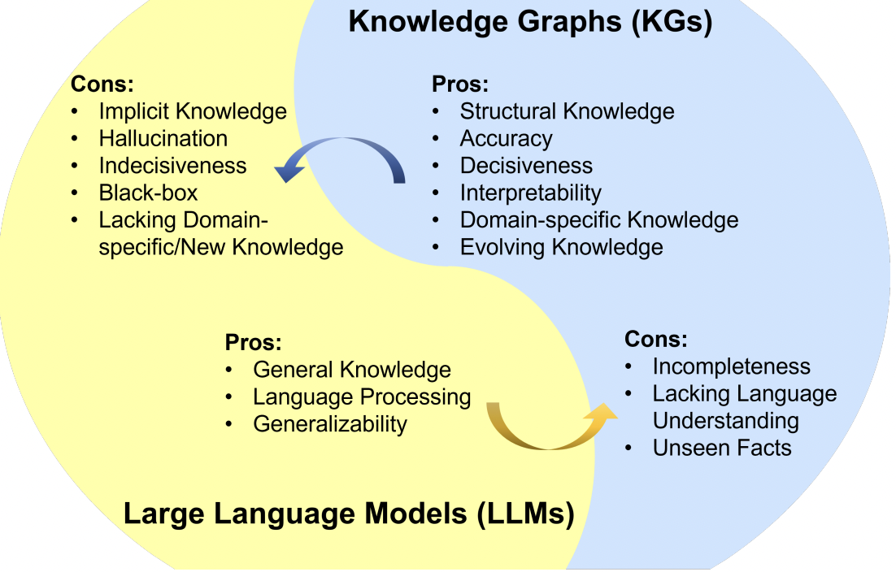

- good explanation on fundamental difference between [[knowledge graphs]] and [[llms]]
	- [unifying large language models and knowledge graphs: a roadmap](https://cyb.ai/oracle/ask/QmdGEYVKo1sRURzbj83UMtr77EL6GHUB2taJbnpTynEQKT)
- 
- insights are the following
	- [[knowledge graphs]] and [[llms]] are fundamentally different
	- [[knowledge graphs]] and [[llms]] must interact in any [[intelligent]] system
	- [[knowledge graphs]] and [[llms]] are the key to [[superintelligence]]